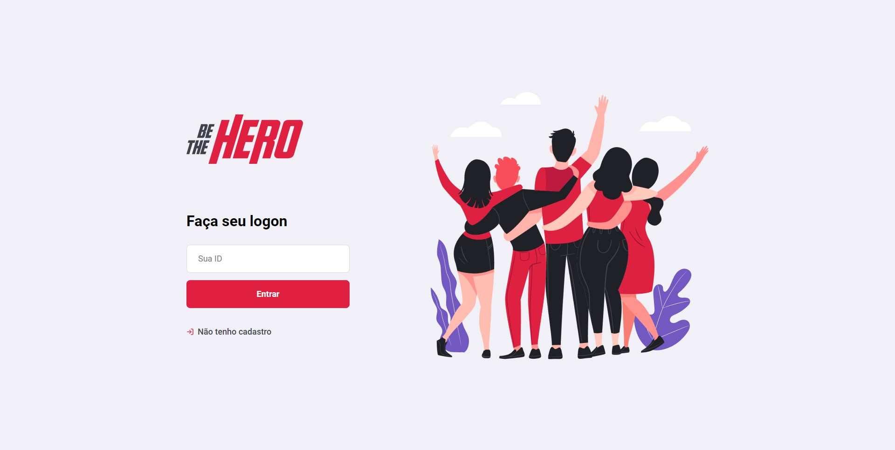
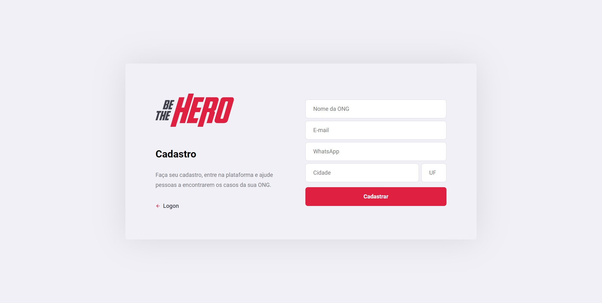
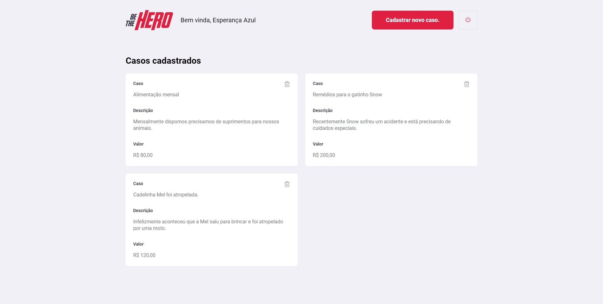
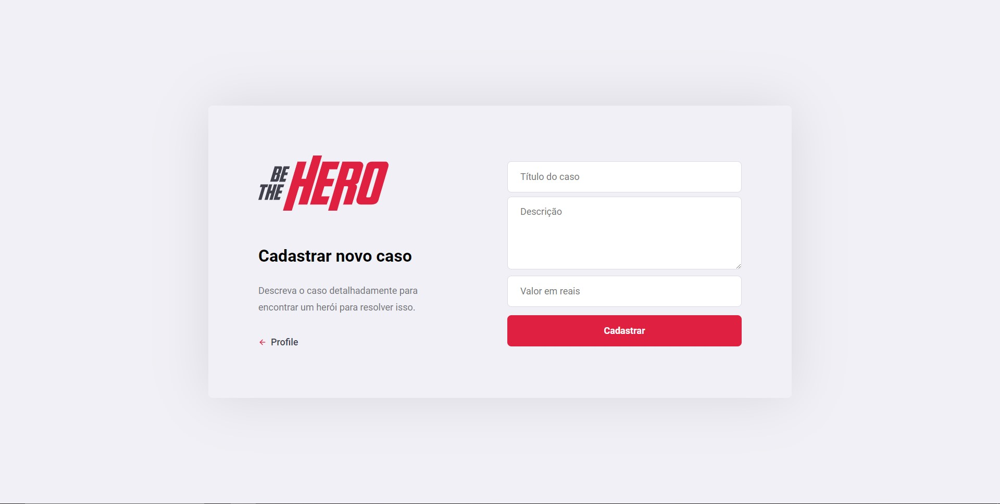
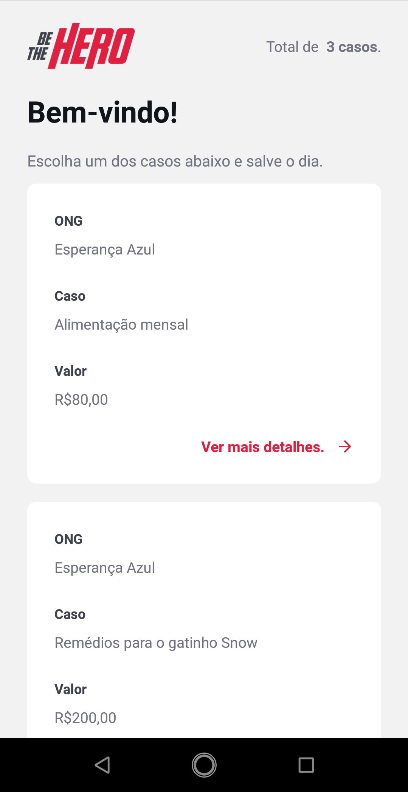
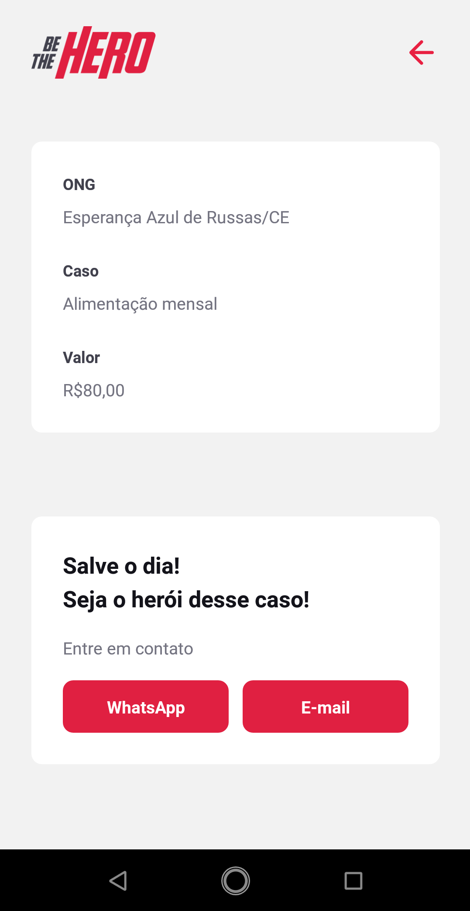

# Be The Hero
A aplicação tem como objetivo conectar ONGs a pessoas que queiram ajudar em seus casos.

## Front-end desenvolvido em [React](https://reactjs.org/).
<p align="center">
  
  
  
  
</p>


## Aplicação mobile desenvolvida em [React Native](https://reactnative.dev/) usando o [Expo](https://expo.io/).
<p align="center">
  
  
  
</p>

## Tecnologias do back-end
- [Node.js](https://nodejs.org/) 
- [Express.js](https://expressjs.com/)
- [Jest](https://jestjs.io/)
- [SuperTest](https://github.com/visionmedia/supertest)
- [Knex.js](http://knexjs.org/)
- [Celebrate](https://github.com/arb/celebrate)
```js
const express = require("express");
const cors = require("cors");
const { errors } = require("celebrate");

const routes = require("./routes");

const app = express();
app.use(cors());
app.use(express.json());
app.use(routes);
app.use(errors());

module.exports = app;
```

## Como executar?
- Backend
  ```sh
  cd backend
  npm install
  npm start
  ```
- Frontend
  ```sh
  cd frontend
  npm install
  npm start
  ```
- Mobile
  ```sh
  cd mobile
  npm install
  npm start
  ```

## Notes
Aplicação da semana OmniStack 11.0. Toda a concepção da ideia foi feita pela [Rocketseat](https://rocketseat.com.br/) <3.